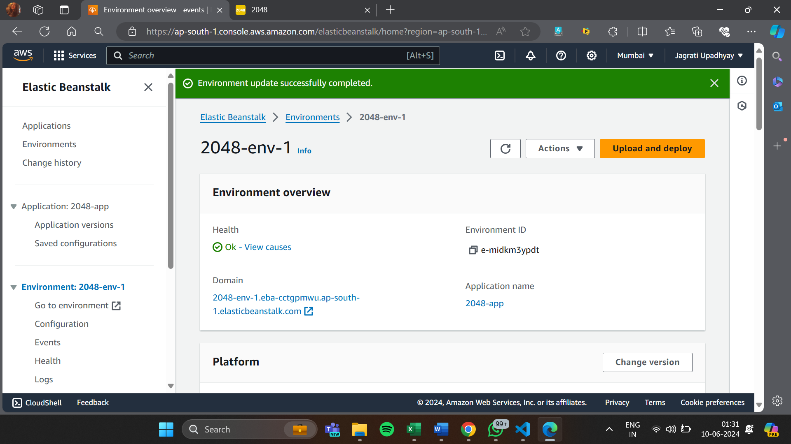
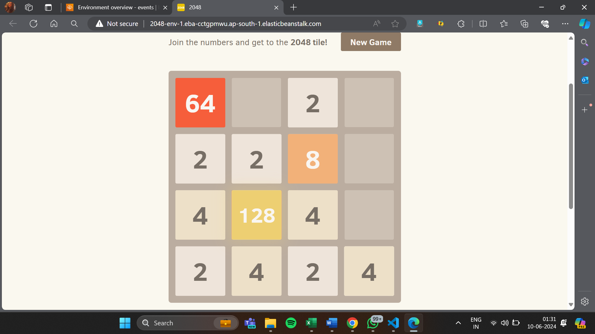

# 2048 Game Deployment on AWS Elastic Beanstalk

This repository contains the necessary files and instructions to deploy a Dockerized version of the 2048 game on AWS Elastic Beanstalk. The 2048 game is a single-player sliding tile puzzle game created by Gabriele Cirulli.

## Prerequisites
Before you begin, ensure you have the following:

- AWS CLI configured with appropriate IAM permissions
- Docker installed on your local machine
- AWS Elastic Beanstalk CLI (EB CLI) installed
- An AWS account
  
## Setup Instructions
1) Clone the Repository:

<pre><code>git clone https://github.com/your-username/2048-game-deployment.git
cd 2048-game-deployment</code></pre>

2) Dockerize the Application:

Ensure you have a Dockerfile in the project directory. 

3) Build the Docker Image:
<pre><code> docker build -t 2048-game .</code></pre>

4) Run the Docker Container Locally (Optional):

<pre><code> docker run -p 80:80 2048-game</code></pre>

Visit http://localhost to see the 2048 game running locally.

## Deployment
1) Create an Elastic Beanstalk Application and Environment:

<pre><code> aws elasticbeanstalk create-application --application-name 2048-app --description "2048 Game Application"
aws elasticbeanstalk create-environment --application-name 2048-app --environment-name 2048-env-1 --solution-stack-name "64bit Amazon Linux 2 v3.8.2 running Docker" --option-settings Namespace=aws:autoscaling:launchconfiguration,OptionName=IamInstanceProfile,Value=aws-elasticbeanstalk-ec2-role</code></pre>

2) Deploy the Application:

Initialize your Elastic Beanstalk repository and deploy the application.

<pre><code> eb init -p docker 2048-app
eb create 2048-env-1</code></pre>

3) Deploy your Docker image:
<pre><code>eb deploy</code></pre>

4) Access the Application:

Once deployed, Elastic Beanstalk will provide a URL to access your application. Visit the URL to play the 2048 game.

## Cleanup
To clean up your AWS resources and avoid incurring charges:

1) Terminate the Elastic Beanstalk Environment:

<pre><code>eb terminate 2048-env-1</code></pre>

2) Delete the Elastic Beanstalk Application:

<pre><code>aws elasticbeanstalk delete-application --application-name 2048-app --terminate-env-by-force </code></pre>

## Reference Images

